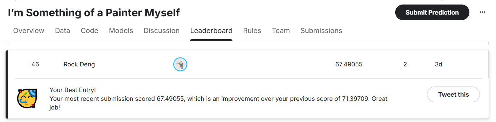

# I'm Something of a Painter Myself - CycleGAN Implementation

## 🎨 Project Overview
This project is a PyTorch implementation of **CycleGAN** for the Kaggle competition **[I'm Something of a Painter Myself](https://www.kaggle.com/competitions/gan-getting-started)**. 

The objective is to perform **Unpaired Image-to-Image Translation**, transforming ordinary landscape photos into paintings in the style of **Claude Monet**. Unlike traditional style transfer which might require paired examples, CycleGAN learns the mapping between two domains (Photos $\leftrightarrow$ Paintings) without needing one-to-one correspondence.

## 🚀 Key Features
*   **CycleGAN Architecture**: Implements the standard CycleGAN with ResNet-based Generators and PatchGAN Discriminators.
*   **Environment Auto-Detection**: The code automatically detects if it's running on **Google Colab**, **Kaggle**, or a **Local Machine** and adjusts file paths and batch sizes accordingly.
*   **Mixed Precision Training**: Utilizes `torch.amp` (Automatic Mixed Precision) for faster training and lower memory usage on modern GPUs.
*   **Robust Training Loop**: Includes Replay Buffers for discriminator stability and linear learning rate decay.
*   **Visual Monitoring**: Automatically generates and displays a sample "Monet-fied" image at the end of every epoch to visualize progress.

## 📂 Dataset
The dataset consists of two unpaired collections:
*   **Domain A (Source)**: ~7,000 real-world landscape photos.
*   **Domain B (Target)**: ~300 paintings by Claude Monet.

*Note: The notebook handles data downloading automatically via `gdown` for Colab/Local environments, or connects to the Kaggle input directory.*

## 🛠️ Model Architecture
*   **Generator**: ResNet architecture with 9 residual blocks. It preserves the spatial structure of the original image while transforming the style.
*   **Discriminator**: 70x70 PatchGAN. It classifies local image patches as real or fake, encouraging high-frequency texture realism.
*   **Loss Functions**:
    *   **Adversarial Loss**: To generate realistic images.
    *   **Cycle Consistency Loss**: To ensure $F(G(x)) \approx x$ (content preservation).
    *   **Identity Loss**: To preserve color composition.

## 🏃‍♂️ Usage
1.  **Clone/Download** this repository.
2.  Open `gan_painter_myself_v2.ipynb` in Jupyter Notebook, VS Code, Google Colab, or Kaggle.
3.  **Run All Cells**.
    *   The notebook will detect your environment.
    *   It will download the dataset (if not on Kaggle).
    *   It will train the model for the specified number of epochs (Default: 30).
    *   It will generate 7,000+ Monet-style images and zip them into `images.zip` for submission.

## ⚙️ Configuration
You can adjust hyperparameters in **Section 4** of the notebook:
*   `BATCH_SIZE`: Auto-configured (32 for A100, 4 for T4/P100, 1 for CPU).
*   `LEARNING_RATE`: Default `2e-4`.
*   `NUM_EPOCHS`: Default `30`. Increase to `100+` for better results.

## 📊 Kaggle Competition Results

**Final Score**: *67.49055*

